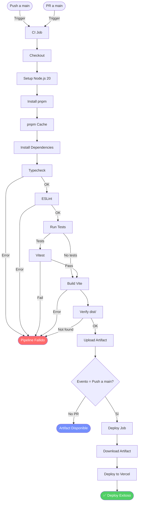

# Documentación del Pipeline CI/CD - FaceAccess Lab

## 1. Información General del Proyecto

| Campo | Descripción |
|-------|-------------|
| **Nombre del Proyecto** | FaceAccess Lab |
| **Framework** | React 19 |
| **Lenguaje** | TypeScript 5.8 |
| **Build Tool** | Vite 6 |
| **Framework de Estilos** | TailwindCSS 4 |
| **Gestor de Paquetes** | pnpm |
| **Runtime** | Node.js 20 |
| **Repositorio** | GitHub |
| **Plataforma de Despliegue** | Vercel |
| **Archivo de Pipeline** | `.github/workflows/ci-cd.yml` |

---

## 2. Arquitectura del Pipeline CI/CD

### 2.1 Diagrama del Flujo



### 2.2 Jobs Definidos

| Job | Nombre | Propósito | Trigger |
|-----|--------|-----------|---------|
| `ci` | Continuous Integration | Validar, verificar y construir el proyecto | push/PR a main |
| `deploy` | Deploy to Vercel | Desplegar a producción | Solo push a main |

---

## 3. Herramientas y Tecnologías Utilizadas

### 3.1 GitHub Actions

| Componente | Versión | Propósito |
|-----------|---------|-----------|
| `actions/checkout` | v4 | Checkout del código fuente |
| `actions/setup-node` | v4 | Configuración de Node.js |
| `actions/cache` | v4 | Cache de dependencias pnpm |
| `actions/upload-artifact` | v4 | Subida de artefactos de build |
| `actions/download-artifact` | v4 | Descarga de artefactos |
| `actions/github-script` | v7 | Comentarios automáticos en PRs |

### 3.2 Herramientas de Desarrollo

| Herramienta | Versión | Propósito |
|-------------|---------|-----------|
| Node.js | 20 | Runtime de JavaScript |
| pnpm | 9 | Gestor de paquetes |
| TypeScript | 5.8 | Verificación de tipos |
| ESLint | 9.x | Análisis estático de código |
| Vitest | 3.x | Framework de pruebas |
| Vite | 6.x | Bundler y build tool |
| Vercel CLI | 56.x | Despliegue a producción |

---

## 4. Estructura del Pipeline

### 4.1 Job: CI (Continuous Integration)

```yaml
ci:
  name: Continuous Integration
  runs-on: ubuntu-latest
```

#### Etapas del Job CI

| # | Etapa | Acción | Descripción |
|---|-------|--------|-------------|
| 1 | Checkout | `actions/checkout@v4` | Descarga el código del repositorio |
| 2 | Setup Node.js | `actions/setup-node@v4` | Configura Node.js 20 con cache de pnpm |
| 3 | Install pnpm | `npm install -g pnpm@9` | Instala pnpm globalmente |
| 4 | pnpm Cache | `actions/cache@v4` | Cachea el store de pnpm para acelerar instalaciones |
| 5 | Install Dependencies | `pnpm install --no-frozen-lockfile` | Instala todas las dependencias del proyecto |
| 6 | TypeScript Check | `pnpm typecheck` | Valida tipos de TypeScript sin emitir archivos |
| 7 | ESLint | `pnpm lint` | Analiza código en busca de errores y warnings |
| 8 | Tests | `pnpm test` | Ejecuta pruebas unitarias (opcional si no existen) |
| 9 | Build | `pnpm build` | Compila la aplicación con Vite |
| 10 | Verify Build | Verificación manual | Confirma que `dist/` existe con `index.html` |
| 11 | Upload Artifact | `actions/upload-artifact@v4` | Sube el build como artefacto |

### 4.2 Job: Deploy

```yaml
deploy:
  name: Deploy to Vercel
  needs: ci
  if: github.event_name == 'push' && github.ref == 'refs/heads/main'
  runs-on: ubuntu-latest
  environment: production
```

#### Etapas del Job Deploy

| # | Etapa | Acción | Descripción |
|---|-------|--------|-------------|
| 1 | Checkout | `actions/checkout@v4` | Descarga código para deploy |
| 2 | Setup Node.js | `actions/setup-node@v4` | Configura Node.js 20 |
| 3 | Install pnpm | `npm install -g pnpm@9` | Instala pnpm |
| 4 | Install Dependencies | `pnpm install --no-frozen-lockfile` | Instala dependencias |
| 5 | Download Artifact | `actions/download-artifact@v4` | Descarga build pre-generado |
| 6 | Deploy to Vercel | `vercel deploy --prebuilt --prod` | Despliega a producción |
| 7 | Comment PR | `actions/github-script@v7` | Commenta URL en PR (si aplica) |

---

## 5. Variables de Entorno y Secrets

### 5.1 Variables de Entorno del Pipeline

| Variable | Valor | Descripción |
|----------|-------|-------------|
| `NODE_VERSION` | `'20'` | Versión de Node.js |
| `PNPM_VERSION` | `'9'` | Versión de pnpm |

### 5.2 Secrets Configurados

| Secret | Descripción | Cómo obtenerlo |
|--------|-------------|----------------|
| `VERCEL_TOKEN` | Token de API de Vercel | `vercel tokens create` |
| `VERCEL_ORG_ID` | ID de organización Vercel | `vercel project ls` |
| `VERCEL_PROJECT_ID` | ID del proyecto Vercel | Dashboard de Vercel |
| `GEMINI_API_KEY` | API key de Google Gemini | Google AI Studio |

### 5.3 Configuración de Secrets en GitHub

```
GitHub Repository → Settings → Secrets and variables → Actions → New repository secret
```

---

## 6. Triggers del Pipeline

| Evento | Rama | Job Ejecutado |
|--------|------|---------------|
| Push | `main` | CI + Deploy |
| Pull Request | `main` | Solo CI |

---

## 7. Scripts de Package.json

```json
{
  "scripts": {
    "dev": "vite --port=3000 --host=0.0.0.0",
    "build": "vite build",
    "preview": "vite preview",
    "clean": "rm -rf dist server.js",
    "lint": "eslint src",
    "typecheck": "tsc --noEmit",
    "test": "vitest run",
    "test:watch": "vitest",
    "test:coverage": "vitest run --coverage"
  }
}
```

---

## 8. Configuración de ESLint

```javascript
// eslint.config.js
import js from '@eslint/js';
import reactHooks from 'eslint-plugin-react-hooks';
import reactRefresh from 'eslint-plugin-react-refresh';
import tseslint from 'typescript-eslint';
import globals from 'globals';

export default tseslint.config(
  { ignores: ['dist', 'node_modules', '.vite'] },
  {
    extends: [js.configs.recommended, ...tseslint.configs.recommended],
    files: ['**/*.{ts,tsx}'],
    languageOptions: { ecmaVersion: 2022, globals: globals.browser },
    plugins: { 'react-hooks': reactHooks, 'react-refresh': reactRefresh },
    rules: {
      ...reactHooks.configs.recommended.rules,
      'react-refresh/only-export-components': ['warn', { allowConstantExport: true }],
      'no-console': ['warn', { allow: ['warn', 'error'] }],
      '@typescript-eslint/no-unused-vars': 'off',
    },
  },
);
```

### Reglas Habilitadas

| Regla | Nivel | Descripción |
|-------|-------|-------------|
| `react-hooks/exhaustive-deps` | Error | Verifica dependencias de hooks |
| `react-refresh/only-export-components` | Warn | Previene errores de fast refresh |
| `no-console` | Warn | Limita uso de console.log |
| `@typescript-eslint/no-unused-vars` | Off | Permite vars no usadas |

---

## 9. Configuración de Vitest

```typescript
// vitest.config.ts
import { defineConfig } from 'vitest/config';
import react from '@vitejs/plugin-react';
import path from 'path';

export default defineConfig({
  plugins: [react()],
  test: {
    environment: 'jsdom',
    globals: true,
    coverage: { provider: 'v8', reporter: ['text', 'json', 'html'] },
  },
  resolve: { alias: { '@': path.resolve(__dirname, '.') } },
});
```

---

## 10. Flujo de Ejecución Completo

### 10.1 Flujo para Push a main

```
┌─────────────────────────────────────────────────────────────┐
│ 1. DEVELOPER REALIZA PUSH                                  │
│    git push origin main                                     │
└──────────────────────────┬──────────────────────────────────┘
                           │
                           ▼
┌─────────────────────────────────────────────────────────────┐
│ 2. GITHUB ACTIONS RECIBE EVENTO                             │
│    Trigger: push → branch: main                              │
└──────────────────────────┬──────────────────────────────────┘
                           │
                           ▼
┌─────────────────────────────────────────────────────────────┐
│ 3. JOB: CI (Continuous Integration)                        │
│                                                             │
│    ✓ Checkout del repositorio                               │
│    ✓ Setup Node.js 20                                       │
│    ✓ Install pnpm 9                                         │
│    ✓ Cache de pnpm store                                    │
│    ✓ Install dependencies                                   │
│    ✓ TypeScript: tsc --noEmit                               │
│    ✓ ESLint: Análisis estático                              │
│    ✓ Tests: vitest run (si existen)                        │
│    ✓ Build: vite build                                      │
│    ✓ Verify: dist/ existe                                   │
│    ✓ Upload Artifact: vercel-build                          │
└──────────────────────────┬──────────────────────────────────┘
                           │
                           ▼
┌─────────────────────────────────────────────────────────────┐
│ 4. JOB: DEPLOY (solo si push a main)                       │
│                                                             │
│    ✓ Download Artifact                                     │
│    ✓ Deploy to Vercel --prebuilt --prod                    │
│    ✓ Variables de entorno configuradas                     │
└──────────────────────────┬──────────────────────────────────┘
                           │
                           ▼
┌─────────────────────────────────────────────────────────────┐
│ 5. VERIFICATION                                            │
│    - GitHub Actions: ✓ Green                                │
│    - Artifact: vercel-build disponible                      │
│    - Vercel Dashboard: Nueva URL de producción              │
└─────────────────────────────────────────────────────────────┘
```

### 10.2 Flujo para Pull Request

```
┌─────────────────────────────────────────────────────────────┐
│ 1. DEVELOPER ABRE PR                                       │
│    Pull request → main                                     │
└──────────────────────────┬──────────────────────────────────┘
                           │
                           ▼
┌─────────────────────────────────────────────────────────────┐
│ 2. GITHUB ACTIONS RECIBE EVENTO                             │
│    Trigger: pull_request → branch: main                     │
└──────────────────────────┬──────────────────────────────────┘
                           │
                           ▼
┌─────────────────────────────────────────────────────────────┐
│ 3. JOB: CI SOLAMENTE                                       │
│    (Deploy NO se ejecuta)                                  │
│                                                             │
│    ✓ Mismos pasos que push                                  │
│    ✓ Artifact generado                                     │
│    ✓ Comment automático en PR                              │
└──────────────────────────┬──────────────────────────────────┘
                           │
                           ▼
┌─────────────────────────────────────────────────────────────┐
│ 4. VERIFICATION                                            │
│    - CI Status en PR: Pass/Fail                            │
│    - Artifact disponible para descarga                     │
│    - Deployment URL en comentario                          │
└─────────────────────────────────────────────────────────────┘
```

---

## 11. Beneficios del Pipeline Implementado

| Beneficio | Descripción |
|-----------|-------------|
| **Automatización** | No requiere intervención manual |
| **Consistencia** | Mismo proceso en cada commit |
| **Velocidad** | Cache de dependencias acelera ejecuciones |
| **Calidad** | Validaciones de TypeScript y ESLint |
| **Trazabilidad** | Artefactos disponibles por 7 días |
| **Despliegue Seguro** | Solo en push a main, no en PRs |
| **Feedback Rápido** | Comentarios automáticos en PRs |

---

## 12. Comandos para Gestión Local

### Instalación y Desarrollo

```bash
# Instalar dependencias
pnpm install

# Desarrollo local
pnpm dev

# Compilar para producción
pnpm build
```

### Validaciones

```bash
# Verificación de tipos
pnpm typecheck

# Análisis de código
pnpm lint

# Pruebas unitarias
pnpm test

# Coverage de pruebas
pnpm test:coverage
```

### Despliegue Manual

```bash
# Instalar Vercel CLI
npm install -g vercel

# Desplegar a producción
vercel deploy --prebuilt --prod \
  --token=YOUR_VERCEL_TOKEN \
  --env GEMINI_API_KEY=YOUR_KEY
```

---

## 13. Verificación del Pipeline

### Desde GitHub Actions

1. Ir a **Actions** en el repositorio
2. Seleccionar **CI/CD Pipeline**
3. Verificar estado de cada job
4. Revisar logs de cada paso

### Descargar Artefacto

1. Ir a **Actions** → Job completado
2. Buscar **Artifacts** → **vercel-build**
3. Descargar y verificar contenido

### Verificar Despliegue

1. Acceder a **Vercel Dashboard**
2. Revisar **Deployments**
3. Verificar URL de producción

---

## 14. Capturas de Configuración (Guía)

### A. Secrets en GitHub

```
Settings → Secrets and variables → Actions → New repository secret
```

### B. Pipeline Status

```
Actions → CI/CD Pipeline → [Run más reciente] → ✓ verde
```

### C. Artifact

```
Actions → CI/CD Pipeline → Run → Artifacts → vercel-build
```

### D. Vercel Dashboard

```
vercel.com/dashboard → Projects → faceaccess-lab → Deployments
```

---

## 15. Información del Repositorio

| Campo | Valor |
|-------|-------|
| **Repositorio** | https://github.com/[owner]/[repo] |
| **Rama Principal** | main |
| **Archivo de Pipeline** | `.github/workflows/ci-cd.yml` |
| **Artifact Name** | vercel-build |
| **Retention** | 7 días |

---

## 16. Conclusiones

El pipeline CI/CD implementado automatiza completamente el proceso de integración y despliegue del proyecto FaceAccess Lab. Las principales características son:

1. **Integración Continua (CI)**: Validación automática de código en cada push y pull request
2. **Despliegue Continuo (CD)**: Entrega automática a producción solo en push a main
3. **Cache Inteligente**: Optimización de tiempo mediante cache de pnpm
4. **Validaciones Múltiples**: TypeScript, ESLint y build verification
5. **Seguridad**: Secrets gestionados correctamente en GitHub
6. **Feedback**: Comentarios automáticos en pull requests

Este pipeline garantiza que el código desplegado siempre ha pasado por un proceso de validación robusto, reduciendo errores y asegurando calidad en producción.

---

## 17. Referencias

- [GitHub Actions Documentation](https://docs.github.com/en/actions)
- [Vercel CLI Documentation](https://vercel.com/docs/cli)
- [pnpm Documentation](https://pnpm.io/)
- [ESLint Configuration](https://eslint.org/docs/user-guide/configuring/)
- [Vitest Documentation](https://vitest.dev/)
- [TypeScript Documentation](https://www.typescriptlang.org/docs/)
