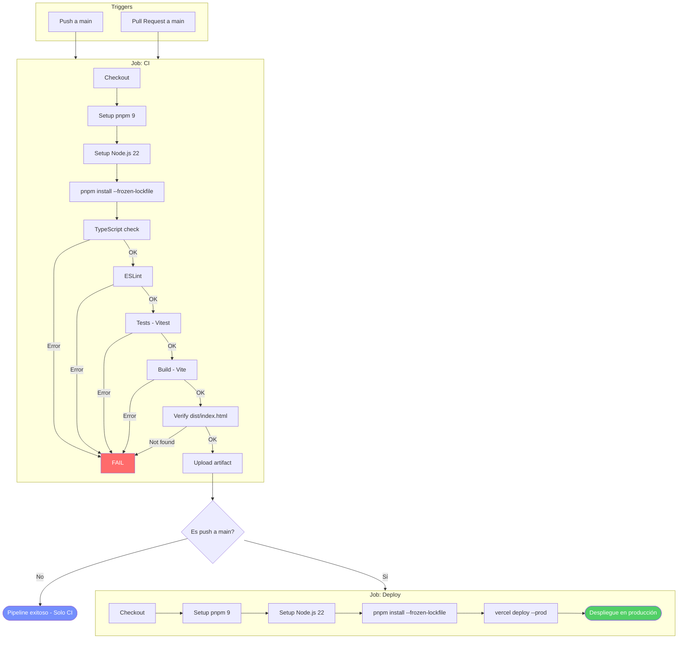
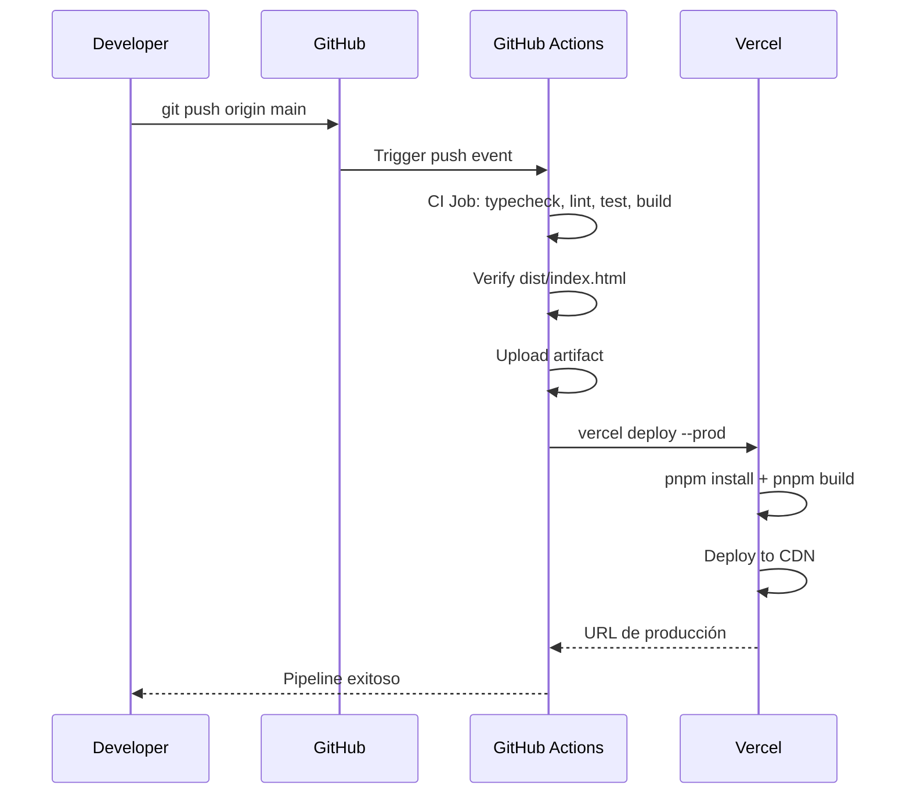

# Documentación del Pipeline CI/CD — FaceAccess Lab

---

## 1. Información general

| Campo | Valor |
|-------|-------|
| **Proyecto** | FaceAccess Lab |
| **Framework** | React 19 |
| **Lenguaje** | TypeScript 5.8 |
| **Build tool** | Vite 6 |
| **Estilos** | TailwindCSS 4 |
| **Gestor de paquetes** | pnpm 9 |
| **Runtime** | Node.js 22 LTS |
| **Repositorio** | https://github.com/Ismael-1105/proyecto-septimo-ciclo-nube |
| **Rama principal** | `main` |
| **Plataforma de despliegue** | Vercel |
| **Archivo del pipeline** | `.github/workflows/ci-cd.yml` |

---

## 2. Herramientas utilizadas

### 2.1 GitHub Actions

| Acción oficial | Versión | Función |
|----------------|---------|---------|
| `actions/checkout` | v4 | Descarga el repositorio en el runner |
| `pnpm/action-setup` | v4 | Instala pnpm con versión controlada |
| `actions/setup-node` | v4 | Configura Node.js con cache nativo de pnpm |
| `actions/upload-artifact` | v4 | Sube el build como artefacto descargable |

### 2.2 Stack de desarrollo

| Herramienta | Versión | Uso en CI |
|-------------|---------|-----------|
| Node.js | 22 LTS | Runtime del runner |
| pnpm | 9 | Gestor de paquetes con `--frozen-lockfile` |
| TypeScript | 5.8 | `tsc --noEmit` — verificación de tipos |
| ESLint | 9.x | `eslint src` — análisis estático |
| Vitest | 3.x | `vitest run` — pruebas unitarias |
| Vite | 6.x | `vite build` — compilación a producción |
| Vercel CLI | latest | `vercel deploy --prod` — despliegue |

---

## 3. Estructura del pipeline

```
.github/workflows/ci-cd.yml
├── triggers: push a main, pull_request a main
│
├── job: ci (Continuous Integration)
│   ├── Checkout
│   ├── Setup pnpm 9
│   ├── Setup Node.js 22 (cache: pnpm)
│   ├── pnpm install --frozen-lockfile
│   ├── TypeScript check
│   ├── ESLint
│   ├── Tests (Vitest)
│   ├── Build (Vite)
│   ├── Verify dist/index.html
│   └── Upload artifact (vercel-build, 7 días)
│
└── job: deploy (Continuous Deployment)
    ├── needs: ci
    ├── condition: push a main (no PR)
    ├── environment: production
    ├── Checkout
    ├── Setup pnpm 9
    ├── Setup Node.js 22 (cache: pnpm)
    ├── pnpm install --frozen-lockfile
    └── npx vercel deploy --prod
```

---

## 4. Diagrama del flujo CI/CD



---

## 5. Descripción detallada de cada etapa

### Job: CI

| # | Etapa | Comando / Acción | Qué hace y por qué |
|---|-------|-----------------|-------------------|
| 1 | Checkout | `actions/checkout@v4` | Clona el código fuente del repositorio en el runner efímero de Ubuntu. |
| 2 | Setup pnpm | `pnpm/action-setup@v4` (version: 9) | Instala pnpm 9. Se pineó a v9 porque pnpm 11+ requiere Node ≥22.13 y usa `node:sqlite`, módulo no disponible en Node 22.0–22.12. |
| 3 | Setup Node.js | `actions/setup-node@v4` (22, cache: pnpm) | Configura Node.js 22 LTS. El parámetro `cache: pnpm` habilita el cache nativo del store de pnpm, eliminando la necesidad de `actions/cache`. |
| 4 | Install | `pnpm install --frozen-lockfile` | Instala dependencias de forma determinista. `--frozen-lockfile` garantiza que el lockfile no se modifique en CI. Si hay cambios en `package.json` sin actualizar el lockfile, el pipeline falla intencionalmente. |
| 5 | TypeScript | `pnpm typecheck` → `tsc --noEmit` | Verifica todos los tipos del proyecto. No emite archivos, solo valida. Detecta errores de tipado antes de llegar a producción. |
| 6 | ESLint | `pnpm lint` → `eslint src` | Análisis estático de código. Reglas activas: hooks de React, React Refresh, no-console. Variables no usadas están como `off` para evitar fallos por imports de desarrollo. |
| 7 | Tests | `vitest run` (condicional) | Ejecuta pruebas solo si existen archivos `.test.*` o `.spec.*` en `src/`. Si no hay tests, muestra "No test files found, skipping" sin fallar. |
| 8 | Build | `pnpm build` → `vite build` | Compila la aplicación con Vite 6. Genera la carpeta `dist/` con HTML, JS y CSS optimizados. |
| 9 | Verify | `test -f dist/index.html` | Verifica que el build generó correctamente `dist/index.html`. Si no existe, el pipeline falla inmediatamente. |
| 10 | Artifact | `actions/upload-artifact@v4` | Sube `dist/` como artefacto `vercel-build` disponible por 7 días para descarga manual o debugging. |

### Job: Deploy

| # | Etapa | Comando / Acción | Qué hace y por qué |
|---|-------|-----------------|-------------------|
| 1 | Checkout | `actions/checkout@v4` | Clona el repositorio (necesario porque `vercel.json` y el código fuente deben estar presentes para que Vercel ejecute su build). |
| 2 | Setup pnpm | `pnpm/action-setup@v4` (version: 9) | Instala pnpm para que Vercel pueda ejecutar `pnpm install` y `pnpm build` según `vercel.json`. |
| 3 | Setup Node.js | `actions/setup-node@v4` (22, cache: pnpm) | Configura Node.js con cache de pnpm para acelerar la instalación de dependencias en el deploy. |
| 4 | Install | `pnpm install --frozen-lockfile` | Instala dependencias localmente. Vercel CLI necesita que el proyecto pueda resolverse antes de iniciar su propio build. |
| 5 | Deploy | `npx vercel@latest deploy --prod --token=***` | Despliega a producción. Vercel lee `vercel.json`, ejecuta `pnpm build` y publica el resultado. `VERCEL_ORG_ID` y `VERCEL_PROJECT_ID` se pasan como variables de entorno para identificar el proyecto. |

---

## 6. Configuración de calidad y seguridad

### 6.1 ESLint

```javascript
// eslint.config.js — ESLint 9 con flat config
export default tseslint.config(
  { ignores: ['dist', 'node_modules', '.vite'] },
  {
    extends: [js.configs.recommended, ...tseslint.configs.recommended],
    files: ['**/*.{ts,tsx}'],
    plugins: { 'react-hooks': reactHooks, 'react-refresh': reactRefresh },
    rules: {
      ...reactHooks.configs.recommended.rules,
      'no-console': ['warn', { allow: ['warn', 'error'] }],
    },
  },
);
```

| Regla | Nivel | Propósito |
|-------|-------|-----------|
| `react-hooks/exhaustive-deps` | Error | Previene bugs por dependencias incorrectas en hooks |
| `react-refresh/only-export-components` | Warn | Compatibilidad con HMR de Vite |
| `no-console` | Warn | Evita logs en producción (permite `warn` y `error`) |
| `@typescript-eslint/*` | Recomendado | Buenas prácticas de TypeScript |

### 6.2 TypeScript

```json
// tsconfig.json
{
  "compilerOptions": {
    "target": "ES2022",
    "module": "ESNext",
    "moduleResolution": "bundler",
    "jsx": "react-jsx",
    "noEmit": true,
    "skipLibCheck": true,
    "isolatedModules": true
  }
}
```

El comando `tsc --noEmit` verifica todos los tipos sin generar archivos. Es la primera barrera de calidad en el pipeline.

### 6.3 Vitest

```typescript
// vitest.config.ts
export default defineConfig({
  plugins: [react()],
  test: {
    environment: 'jsdom',
    globals: true,
    coverage: { provider: 'v8', reporter: ['text', 'json', 'html'] },
  },
});
```

El pipeline ejecuta Vitest con `jsdom` como entorno. El paso es condicional: si no existen archivos de prueba, se omite sin fallar. Cuando se agreguen tests, se ejecutarán automáticamente.

---

## 7. Gestión de secretos

Los siguientes secrets deben configurarse en **GitHub → Settings → Secrets and variables → Actions**:

| Secret | Descripción | Comando para obtenerlo |
|--------|-------------|----------------------|
| `VERCEL_TOKEN` | Token de API de Vercel | `vercel tokens create` |
| `VERCEL_ORG_ID` | ID de la organización en Vercel | `cat .vercel/project.json` |
| `VERCEL_PROJECT_ID` | ID del proyecto en Vercel | `cat .vercel/project.json` |

Las variables de entorno de la aplicación (como `GEMINI_API_KEY`) se administran exclusivamente desde **Vercel Dashboard → Settings → Environment Variables**, no desde el pipeline. Esto evita que valores sensibles aparezcan en los logs de GitHub Actions.

---

## 8. Triggers del pipeline

| Evento | Rama | Jobs ejecutados |
|--------|------|----------------|
| `push` | `main` | CI → Deploy |
| `pull_request` | hacia `main` | Solo CI |

El deploy solo se dispara en push a `main`. Los PRs ejecutan únicamente validaciones, protegiendo la rama de producción.

---

## 9. Proceso de despliegue



---

## 10. Evidencias solicitadas

### 10.1 Capturas de configuración del pipeline

> 📸 **Instrucción:** Toma captura de:
> - `Settings → Secrets and variables → Actions` mostrando los 3 secrets configurados
> - `Actions → CI/CD Pipeline → [último run]` mostrando el estado verde
> - `Actions → CI/CD Pipeline → [run] → CI job` expandido mostrando todas las etapas ✓

### 10.2 Evidencia de ejecución satisfactoria

> 📸 **Instrucción:** Toma captura de cada etapa del CI job:
> - TypeScript check ✓
> - Lint ✓
> - Test ✓
> - Build ✓
> - Verify build output ✓
> - Upload artifact ✓

### 10.3 Captura del despliegue final

> 📸 **Instrucción:** Toma captura de:
> - `Vercel Dashboard → Deployments → [último deployment]` con estado "Ready"
> - La URL de producción abierta en el navegador

---

## 11. Comandos útiles

```bash
# Ejecutar pipeline completo localmente (simulación)
pnpm typecheck && pnpm lint && pnpm test && pnpm build

# Desplegar manualmente
npx vercel deploy --prod

# Ver logs del pipeline
gh run view --log

# Re-ejecutar un workflow fallido
gh run rerun <run-id>
```

---

## 12. Problemas resueltos durante la implementación

| Problema | Causa | Solución |
|----------|-------|----------|
| `node:sqlite` not found | pnpm 11 requiere Node ≥22.13 | Pinear `pnpm/action-setup@v4` con `version: 9` |
| Node 20 descargado en vez de 22 | Variable de entorno no resolvía | Hardcodear `node-version: 22` |
| Cache manual complejo | `actions/cache` manual para store de pnpm | Usar `cache: pnpm` nativo de `setup-node` |
| `--env GEMINI_API_KEY` en logs | Secret visible en CLI | Administrar env vars desde Vercel Dashboard |
| `--prebuilt` sin `.vercel/output` | Vite genera `dist/`, no `.vercel/output` | Usar `vercel deploy --prod` sin `--prebuilt` |
| Lockfile desactualizado | Nuevas dependencias sin commitear el lockfile | Ejecutar `pnpm install` local y commitear |
| Step "Comment PR" nunca ejecutado | Deploy solo corre en push, step verificaba PR | Eliminar código muerto |

---

## 13. Paquetes añadidos al proyecto

| Paquete | Versión | Propósito |
|---------|---------|-----------|
| `eslint` | ^9.0.0 | Linter |
| `@eslint/js` | ^9.0.0 | Config base ESLint 9 |
| `typescript-eslint` | ^8.0.0 | Reglas TS para ESLint |
| `eslint-plugin-react-hooks` | ^5.0.0 | Reglas de hooks de React |
| `eslint-plugin-react-refresh` | ^0.4.0 | Fast refresh con Vite |
| `globals` | ^15.0.0 | Definiciones de globales |
| `vitest` | ^3.0.0 | Framework de testing |
| `@vitest/coverage-v8` | ^3.0.0 | Cobertura para Vitest |
| `@types/react` | ^19.0.0 | Tipos de React |
| `@types/react-dom` | ^19.0.0 | Tipos de React DOM |

---

## 14. Conclusión

El pipeline CI/CD implementado automatiza completamente el ciclo de integración y despliegue del proyecto FaceAccess Lab:

- **Integración Continua:** Cada push y PR activa typecheck, lint, test y build. Si cualquier etapa falla, el pipeline se detiene inmediatamente.
- **Despliegue Continuo:** Solo en push a `main`, el código validado se despliega automáticamente a Vercel.
- **Calidad de código:** ESLint + TypeScript actúan como barreras de calidad antes del build.
- **Seguridad:** Secrets gestionados en GitHub, variables de entorno en Vercel Dashboard.
- **Velocidad:** Cache nativo de pnpm en `setup-node` acelera las ejecuciones.
- **Trazabilidad:** Artefactos de build disponibles por 7 días para auditoría.
